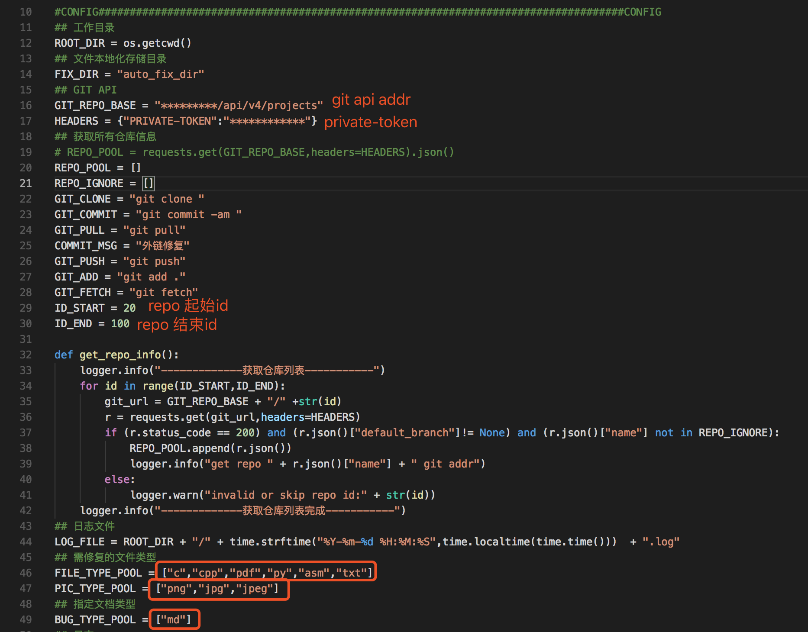
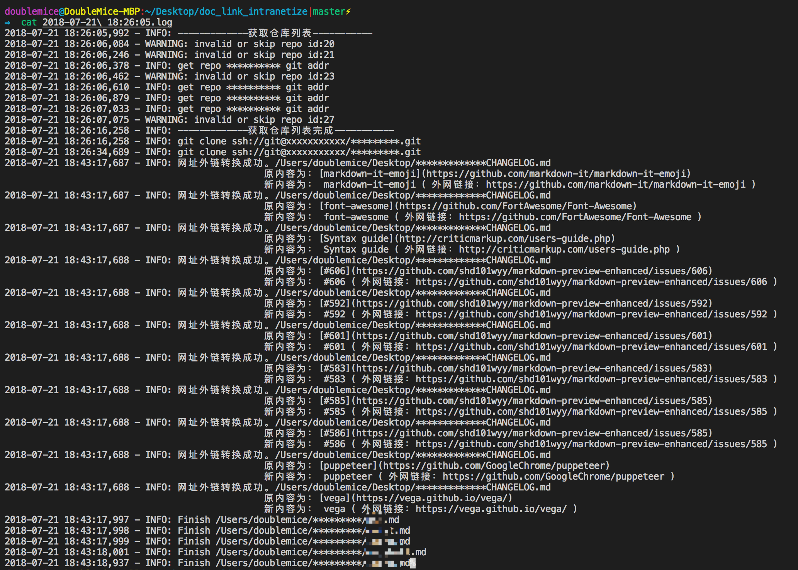

# 外链内网化

## requirement
- tested with python2
- time
- requests
- os
- re
- logging


## fix.py
递归遍历指定目录，使得文本中的外链内网可用或添加文字标识
执行过程
- 获取git链接
- git clone
- 遍历文件
- git commit
- git push

### 一些正则：
- site:`(?<!!)\[[^\]]*?\]\((?:[a-zA-z]+://[^\s]*?|www\.[^\s]*?)\)`
- file:`(?<!!)\[[^\]]*?\]\((?:[a-zA-z]+://[^\s]*?|www\.[^\s]*?)\.(?:pdf|py|cpp|asm|mp3)\)`

## 用法



配置好之后
```
python main.py
```

## log



## FINISHED
1. 将指定后缀的外链图片下载到本地、替换md链接
2. 将指定后缀的外链文件下载到本地、替换md链接
3. 页面的url替换为文本，并标明为外网链接
4. 指定需修复的文档后缀
5. fix.py测试 


## TODO
1. 识别简单页面，并下载到本地、替换md链接；或者selenium打开页面截个图替换也行？
2. 多文档引用同一外链资源导致的资源重复下载
3. 括号嵌套无法正确匹配，如`\[举个\[这里是[🌰]栗子]](https://github.com/(example)/example_repo)`
    python re模块似乎不支持平衡组。除了用栈对括号进行匹配没想到比较简单有效v的解决方法
